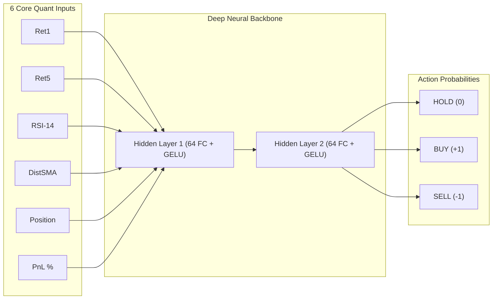

# ⚡ FXFORGE NEW ENGINE
### Institutional Active Deep Reinforcement Learning Trading Cockpit (6-Feature Quant Studio)

[](https://github.com/superman-owner/NEW-ENGINE)
[](LICENSE)
[](https://github.com/superman-owner/NEW-ENGINE)
[](https://www.mql5.com)

**FXFORGE NEW ENGINE** คือสตูดิโอเทรดดิ้ง Deep Reinforcement Learning (DRL) ระดับสถาบันการเงิน ออกแบบในธีม **Apple Pro Dark OLED (`#000000`/`#060608`)** เพื่อความรวดเร็ว เรียบหรู และแสดงผลข้อมูลเชิงลึกทางสถิติ (Quant Telemetry) ได้อย่างคมชัดที่สุด ขับเคลื่อนด้วยโครงข่าย **6-Feature Policy Gradient Active Trading Core** ที่เน้นความเด็ดขาดในการเข้าออเดอร์ตามเทรนด์ ไม่กระจายสุ่มกั๊ก พร้อมระบบส่งออกโมเดล **ONNX** และโค้ด **MQL5 Expert Advisor** ใช้งานบน MetaTrader 5 ได้ทันทีใน 1-Click

---

## 🌟 ฟีเจอร์หลัก (Key Features)

### 🧠 1. 6-Feature Stationary Quant Architecture (โครงข่าย 6 ตัวแปรระดับสถาบัน)
โมเดลขจัดสัญญาณรบกวน (Noise) โดยคัดเลือกเฉพาะ 6 สัญญาณ Alpha ที่มีความคงที่ทางสถิติ (Stationary) สูงสุด:
1. 🟢 **`Ret1`** : ผลตอบแทนโมเมนตัม 1 แท่งเทียนย้อนหลัง
2. 🟢 **`Ret5`** : ผลตอบแทนโมเมนตัม 5 แท่งเทียนย้อนหลัง
3. 🟢 **`RSI`** : ดัชนี RSI-14 ปรับสเกล Normalized ให้อยู่ในช่วง $[-1.0, +1.0]$
4. 🟢 **`DistSMA`** : ระยะห่างสัมพัทธ์ของราคาจากเส้นค่าเฉลี่ย SMA-20
5. 🟢 **`Position`** : สถานะการถือครองสัญญา (`-1.0` Short, `0.0` Flat, `+1.0` Long)
6. 🟢 **`PnL`** : กำไรหรือขาดทุนที่ยังไม่ปิดสถานะ (`Unrealized PnL %`)



---

### 🖥️ 2. Multi-Tab Cockpit Visualizer (หน้าจอควบคุม 4 มิติ)

* 🧭 **Master Tachometer & KPI Matrix (ด้านบน):**
  * มาตรวัด **Win Rate Radial Gauge**
  * ป้ายสถิติ **Validation Sharpe Ratio**, **Max Drawdown %**, **Sortino Ratio**, และ **Total Trades Count**
* 🔮 **Tab 1: 3D Neural Link (6-Feature Active RL):**
  * โครงข่ายประสาทเทียม 3D แสดงผลแบบเวกเตอร์หมุนได้อิสระรอบทิศทาง
  * แสดงอนุภาคไฟสัญญาณ (Firing Synapse Pulses) วิ่งตามรอบการคำนวณจริง
  * ป้ายแสดงสัดส่วนความน่าจะเป็น `[ HOLD: % ] [ BUY: % ] [ SELL: % ]` แบบเรียลไทม์
* 📈 **Tab 2: RL Reward Curve & Telemetry:**
  * เส้นกราฟผลตอบแทน In-Sample Train (เขียว) เทียบกับ Out-of-Sample Test (ฟ้า)
  * เส้นประ 10-Episode Moving Average ติดตามแนวโน้มการลู่เข้า (Convergence)
* 📋 **Tab 3: Live Execution Journal:**
  * ตารางบันทึก Order Fills จำลอง (Bar Step, Time, Direction, Entry/Exit Price, Return %, PnL USD, Account Equity)
  * ปุ่ม **Download CSV** บันทึกประวัติการเทรดออกไปวิเคราะห์ต่อ
* 🛡️ **Tab 4: Monte Carlo Stress Test:**
  * จำลองความเสี่ยง 1,000 Permutations เพื่อหา **95% Value at Risk (VaR)** และ **Worst-Case Drawdown**
* 📊 **Bottom Live 6-Dim Tensor Bar:**
  * แถบแสดงค่าเวกเตอร์ Quant 6 ตัวแปรสดๆ ใต้หน้าจอในทุกเสี้ยววินาที

---

### 💾 3. 1-Click MetaTrader 5 & ONNX Deployment

* 🚀 **Export EA:** สร้างซอร์สโค้ด `ONNX_RL_Trader_EA.mq5` ที่รองรับ Input Tensor ขนาด `[1, 6]` พร้อมใช้งาน
* 📦 **Deploy MT5:** ส่งออกไฟล์โมเดล `rl_trading_model.onnx` ลงในโฟลเดอร์ `MQL5/Files/` โดยอัตโนมัติ

---

## 📂 โครงสร้างโปรเจกต์ (Project Structure)

```text
Z:\NEW-ENGINE\
├── electron\
│   ├── main.cjs                   # Electron Desktop Native Window Controller
│   └── preload.cjs                # Secure IPC Context Bridge
├── src\
│   ├── components\
│   │   ├── TopNavbar.tsx          # Apple Glassmorphic Header & Strategy Selector
│   │   ├── SidebarControls.tsx    # Hyperparameters & Asset Console
│   │   ├── MasterTachometer.tsx   # Win Rate & Quant KPI Cards
│   │   ├── WalkForwardChart.tsx   # Real-time Reward Canvas Curve
│   │   ├── Neural3DLink.tsx       # 3D Interactive Mesh & Synapse Visualizer
│   │   ├── TradesJournal.tsx      # Execution Order Table + CSV Downloader
│   │   ├── MonteCarloStressTest.tsx # 1,000-Permutation VaR Histogram
│   │   ├── LiveTensorBar.tsx      # Bottom 6-Dim Vector Telemetry Strip
│   │   ├── CreatePresetModal.tsx  # Interactive Custom Preset Builder
│   │   └── EngineSettingsModal.tsx# Frictions & Risk Cutoff Settings
│   ├── services\
│   │   ├── ppoEngine.ts           # Vectorized High-Speed Browser Simulation Engine
│   │   └── onnxMql5Generator.ts   # MQL5 Expert Advisor & ONNX Blueprint Code Generator
│   ├── types\
│   │   └── ppo.ts                 # TypeScript Interface Definitions
│   ├── App.tsx                    # Master Studio Layout & Event Coordinator
│   ├── main.tsx                   # React Entry Point
│   └── index.css                  # Apple OLED Styling & Specular Tokens
├── engine_ppo.py                  # Standalone Python Policy Gradient Script (PyTorch)
├── train_rl_trader.py             # Backup PyTorch Training Engine
├── ONNX_RL_Trader_EA.mq5          # Production MQL5 Trading Bot
├── strategy_presets.json          # Institutional Presets Database
├── START_BROWSER.bat              # 1-Click Launcher (Browser Mode)
├── START_DESKTOP.bat              # 1-Click Launcher (Native Desktop App)
└── package.json                   # Dependencies & Scripts
```

---

## 🚀 วิธีติดตั้งและเปิดใช้งาน (Quick Start)

### 1. ติดตั้ง Dependencies
```powershell
cd Z:\NEW-ENGINE
npm install
```

### 2. รันโปรแกรม (เลือกได้ตามต้องการ)

* 🌐 **เปิดใช้งานบน Web Browser (Chrome / Edge):**
  ```powershell
  npm run dev
  ```
  *(หรือดับเบิ้ลคลิกไฟล์ `START_BROWSER.bat`)*

* 🖥️ **เปิดใช้งานเป็นโปรแกรม Native Desktop App:**
  ```powershell
  npm run electron:dev
  ```
  *(หรือดับเบิ้ลคลิกไฟล์ `START_DESKTOP.bat`)*

* 🐍 **รันโมเดลผ่าน Python PyTorch Backend โดยตรง:**
  ```powershell
  python train_rl_trader.py
  ```

---

## 📈 วิธีนำโมเดลไปรันบน MetaTrader 5 (MT5 Setup)

1. เปิดโปรแกรม **FXFORGE NEW ENGINE** แล้วกดปุ่ม **"START PPO TRAINING"** เพื่อเทรนโมเดล
2. กดปุ่ม **"Deploy MT5"** หรือ **"Export EA"** ด้านบนขวา จะได้ไฟล์:
   * `rl_trading_model.onnx`
   * `ONNX_RL_Trader_EA.mq5`
3. เปิด MetaTrader 5 ไปที่เมนู **File ➔ Open Data Folder**:
   * วางไฟล์ `rl_trading_model.onnx` ไว้ในโฟลเดอร์ `MQL5\Files\`
   * วางไฟล์ `ONNX_RL_Trader_EA.mq5` ไว้ในโฟลเดอร์ `MQL5\Experts\`
4. เปิด **MetaEditor (F4)** คอมไพล์ไฟล์ `ONNX_RL_Trader_EA.mq5` และลาก Expert Advisor ใส่กราฟ `XAUUSD` บน Timeframe `M15` พร้อมเปิด **Algo Trading (AutoTrading)** เริ่มต้นเทรดได้ทันที!

---

## 📄 License & Attribution

Distributed under the **MIT License**. Copyright (c) 2026 **FXFORGE Quant Team**.
Developed with High-Fidelity Deep Reinforcement Learning for Algorithmic Asset Management.
